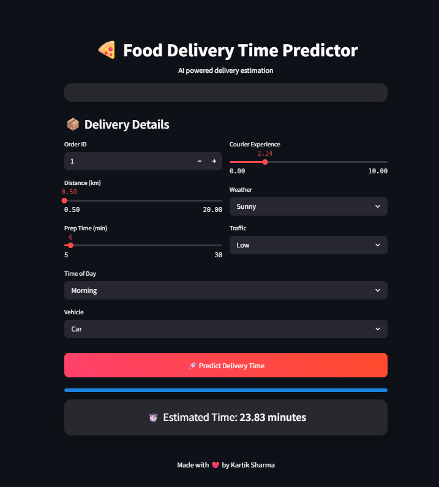

# 🍕 Food Delivery Time Predictor


---

## 🌐 Live Demo
🔗 https://kartiksh123-food-delivery-predictor-food-delivery-app-gesjdg.streamlit.app/

---

## 📸 App Preview


---

## 📌 About the Project
This is a **Machine Learning web application** that predicts food delivery time based on various factors like distance, weather, traffic, and courier experience.

The app uses a **Linear Regression model** and provides real-time predictions through an interactive UI built with Streamlit.

---

## ✨ Features
✔️ Modern animated UI  
✔️ Real-time prediction  
✔️ Progress bar & loading animation  
✔️ Clean and responsive layout  
✔️ Machine learning powered  

---

## 🧠 Tech Stack
| Category | Tools |
|--------|------|
| Language | Python |
| Frontend | Streamlit |
| ML Model | Linear Regression |
| Libraries | Pandas, NumPy, Scikit-learn |

---

## 📂 Project Structure
food-delivery-predictor/
│── app.py
│── best_linear_regression_model.pkl
│── requirements.txt
│── screenshot.png
│── README.md


---

## ⚙️ Installation & Setup

```bash
# Clone repository
git clone https://github.com/Kartiksh123/food-delivery-predictor.git

# Navigate to project
cd food-delivery-predictor

# Install dependencies
pip install -r requirements.txt

# Run app
streamlit run app.py